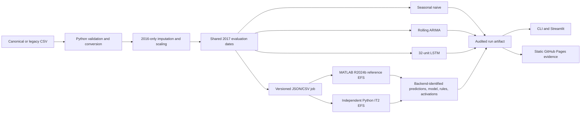

# System architecture

## Backend boundary

Python owns the data contract, leakage controls, evaluation dates, baseline models, metric
aggregation, and artifact manifest. MATLAB owns interval type-2 FIS initialization, three-stage
optimization, inference, and rule explanation. The boundary is a versioned JSON job plus CSV
inputs and outputs; no MATLAB Engine binding is required.

The optional Python IT2 backend consumes the same job and feature contract and emits the same
evidence classes, using `model.npz` plus hash-bearing `model.json` instead of `model.mat`.
Artifacts explicitly identify `matlab` or `python-it2`; cross-backend metrics are never treated as
repeat seeds of one implementation.

For a normal workstation, Python launches `matlab -batch`. Public GitHub runners use the same
job files but execute them through the official MathWorks Action because its temporary public
project license is scoped to that action. Cached job output is accepted only after input hashes,
features, seed, and EFS configuration match.

GitHub Pages is deliberately static. It presents checked-in evidence and never executes MATLAB
or accepts private datasets.
