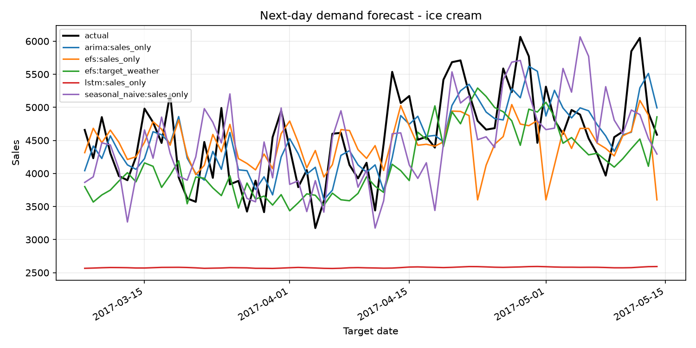
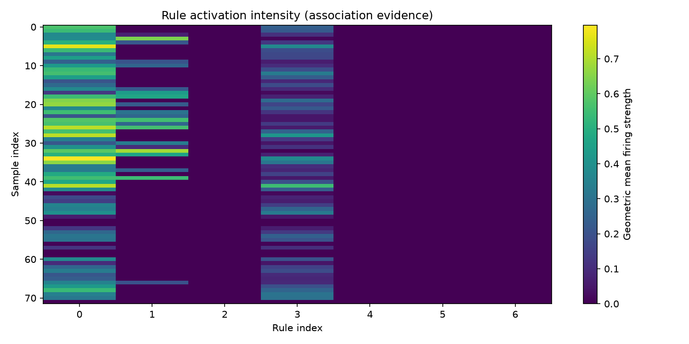
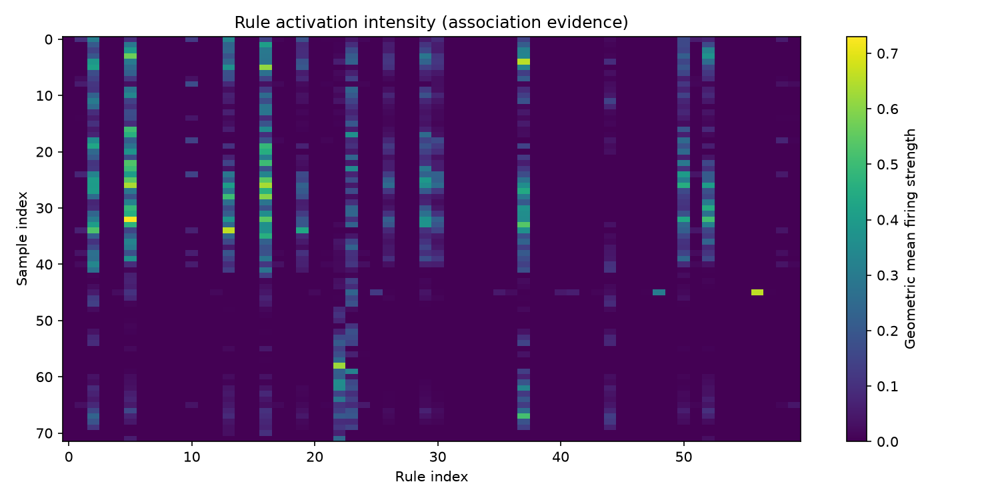

# Audited results

## Synthetic smoke evidence

The table below comes from the successful MATLAB R2024b cross-language workflow at commit
`d475fbf`. It uses one synthetic category, one seed, two GA generations, and five Pattern Search
iterations. These deliberately small settings test the system; they are **not thesis performance
claims** and must not be used to rank the model families.

| Model | Variant | RMSE | MAE | MASE | sMAPE (%) |
| --- | --- | ---: | ---: | ---: | ---: |
| Seasonal naive | sales only | 605.05 | 487.54 | 0.824 | 10.76 |
| ARIMA | sales only | 556.67 | 460.69 | 0.779 | 10.17 |
| LSTM | sales only | 2102.26 | 1993.53 | 3.369 | 54.51 |
| EFS | sales only | 634.29 | 511.09 | 0.864 | 11.37 |
| EFS | target-date weather | 710.56 | 577.22 | 0.975 | 12.98 |

All rows use the same 68 target dates and original sales scale. In this smoke run, target-date
weather increased EFS RMSE by 12.03% relative to sales-only EFS (reported as a `-12.03%`
improvement). This is a valid same-scale ablation result for this artifact, not evidence that
weather is generally harmful.

## Rule evidence

The sales-only smoke model learned 7 rules; the weather model learned 60. Both training summaries
record zero change in upper membership parameters during the final uncertainty stage, confirming
that only the type-2 lower scale/lag parameters were tuned then.

For example, the learned association “`sales_lag_3 is Low` → `Medium`” had support on 66 of 72
prepared test samples, mean activation 0.371, and maximum activation 0.796. This is an empirical
association, not a causal statement or business prescription.

=== "Sales only"

    

=== "Target-date weather"

    

The complete lightweight snapshot, including CSV predictions, rules, and activations, is stored
under `data/precomputed/synthetic-smoke`. Its provenance file identifies the exact workflow run,
commit, and data SHA-256.

## Publication status

No private-data accuracy result is published yet. The full eight-category, three-seed run must be
performed locally with `configs/benchmark.private.example.yaml`; only its resulting manifest,
hash, per-category table, macro summary, and weather ablation can support thesis conclusions.
